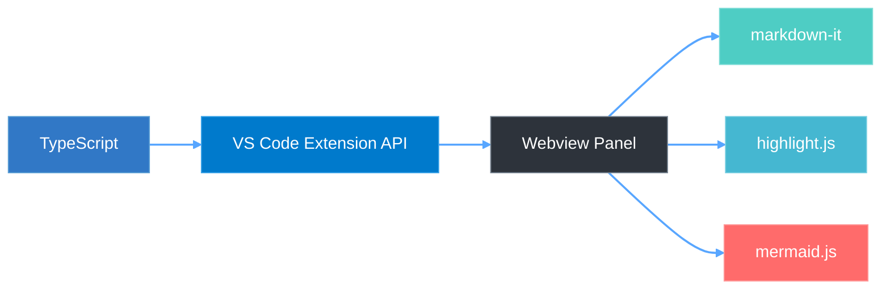

# Markdown Prettier

**The markdown preview VS Code deserves.** Syntax highlighting, Mermaid diagrams, GitHub callouts, slide presentations, inline editing, and AI-powered improvements — all in one beautifully crafted extension.

## Why Markdown Prettier?

Most markdown previewers stop at basic rendering. Markdown Prettier goes further — it turns your `.md` files into a fully interactive workspace with a polished dark UI, live editing, scroll sync, presentation mode, and 20+ slash commands that make writing markdown a joy.

---

## Features at a Glance

| | Feature | Highlights |
|---|---------|------------|
| **Preview** | [Syntax Highlighting](#syntax-highlighting) | highlight.js + Atom One Dark, all major languages |
| | [GitHub Callouts](#github-style-callouts) | NOTE, TIP, IMPORTANT, WARNING, CAUTION |
| | [Mermaid Diagrams](#mermaid-diagrams) | Flowchart, Sequence, Class, State, ER, Gantt, Pie, Git graph |
| | [Rich Text](#rich-text-formatting) | Bold highlight, mark (`==text==`), tables, task lists |
| | | H1–H6 hierarchy, frontmatter stripping, light & dark mode |
| **UX** | [Table of Contents](#table-of-contents-sidebar) | Auto-generated, searchable, collapsible, resizable |
| | [Scroll Sync](#bi-directional-scroll-synchronization) | Bi-directional editor ↔ preview sync |
| | [Presentation Mode](#presentation-mode) | `---` as slide separators, keyboard navigation |
| | [Font Size Controls](#font-size-controls) | A+/A− with session persistence |
| | [PDF Export](#pdf-export) | One-click via headless Chrome |
| | [Inline Editing](#inline-editing--ask-claude) | Double-click edit + Ask Claude AI improvement |
| | [Live Preview](#live-preview) | Real-time updates on every keystroke |
| **Commands** | [20+ Slash Commands](#slash-commands) | Headings, code blocks, tables, diagrams, callouts — with rich autocomplete previews |

---

## Preview

Everything you write is rendered beautifully — code, diagrams, callouts, and more.

### Syntax Highlighting

Full syntax highlighting powered by [highlight.js](https://highlightjs.org/) with the Atom One Dark theme. TypeScript, Python, Go, Rust, Dockerfile, SQL, and many more — all rendered with precision.

### GitHub-style Callouts

`[!NOTE]`, `[!TIP]`, `[!IMPORTANT]`, `[!WARNING]`, and `[!CAUTION]` — rendered with styled icons and colors, just like GitHub.

### Mermaid Diagrams

Write [Mermaid](https://mermaid.js.org/) diagrams and see them rendered instantly — flowcharts, sequence diagrams, class diagrams, state diagrams, ER diagrams, Gantt charts, pie charts, and git graphs. Theming automatically adapts to dark and light modes.

### Rich Text Formatting

Every formatting element is carefully styled for readability:
- **Bold** with subtle background highlight · *Italic* · ~~Strikethrough~~ · `inline code`
- `==highlighted text==` with gradient marker effect (via `markdown-it-mark`)
- Blockquotes with accent border · Tables with alternating row colors · Task lists with checkboxes
- H1–H6 heading hierarchy with distinct color scaling
- YAML frontmatter automatically hidden · Images with responsive sizing
- Full light & dark mode support across all elements

---

## Convenience & UX

### Table of Contents Sidebar

A smart, auto-generated sidebar that makes navigating long documents effortless:
- **Click-to-scroll** with smooth animation and active section highlighting
- **Search & filter** headings instantly
- **Collapsible** with toggle button · **Drag-resizable** width (120px – 500px)
- Hierarchical indent guides · Supports both ATX (`#`) and Setext heading styles

### Bi-directional Scroll Synchronization

Scroll the editor and the preview follows. Scroll the preview and the editor follows. Feedback loop prevention ensures smooth, glitch-free sync in both side-by-side and full-screen modes.

### Presentation Mode

Turn any markdown file into a slide deck — no extra tools needed:
- `---` horizontal rules become slide separators
- Navigate with **Arrow keys**, **Space**, **Home/End** · Press **ESC** to exit
- Smooth sliding transitions with a slide counter

### Font Size Controls

**A+** / **A−** buttons in the top-right corner scale all content proportionally (10px–20px). Your preference persists across sessions.

<video src="https://raw.githubusercontent.com/lyhlg/vscode-markdown-prettier-plugin/main/assets/videos/font.mov" controls muted loop width="100%"></video>

### PDF Export

Export your markdown to PDF with one click. Uses headless Chrome/Chromium/Edge/Brave — full styling, Mermaid diagrams, callouts, and smart page breaks are all preserved.

### Inline Editing & Ask Claude

Edit markdown without leaving the preview:
- **Double-click** any block to edit in-place (Ctrl+Enter to save, Esc to cancel)
- **Full edit mode** via the ✎ button — edit the entire document with Ctrl+S
- **Ask Claude to Improve** — select text, click the floating toolbar, and let AI refine your writing

<video src="https://raw.githubusercontent.com/lyhlg/vscode-markdown-prettier-plugin/main/assets/videos/preview-modify.mov" controls muted loop width="100%"></video>

### Live Preview

Every keystroke updates the preview in real-time. Switch between markdown files and the preview follows automatically.

<video src="https://raw.githubusercontent.com/lyhlg/vscode-markdown-prettier-plugin/main/assets/videos/preview.mov" controls muted loop width="100%"></video>

---

## Slash Commands

Type `/` in any markdown file to access 20+ snippet commands with rich autocomplete previews.

<video src="https://raw.githubusercontent.com/lyhlg/vscode-markdown-prettier-plugin/main/assets/videos/slash.mov" controls muted loop width="100%"></video>

| Command | Description |
|---------|-------------|
| `/h1` `/h2` `/h3` `/h4` | Insert headings |
| `/codeblock` | Code block with language picker (JS, TS, Python, Bash, JSON, HTML, CSS, Dockerfile, YAML, Go, Rust, Java, SQL) |
| `/table` | Markdown table template |
| `/mermaid` | Mermaid diagram with type picker |
| `/mermaid-flowchart` `/mermaid-sequence` `/mermaid-class` | Specific diagram templates |
| `/note` `/tip` `/important` `/warning` `/caution` | GitHub-style callout blocks |
| `/image` `/link` | Media elements |
| `/checkbox` | Task list |
| `/bold` `/italic` `/highlight` `/strikethrough` | Text formatting |
| `/blockquote` `/hr` | Block elements |

Every command includes **rendered preview examples** and **mermaid.ink diagram previews** right in the autocomplete popup.

---

## Getting Started

1. Install from the [VS Code Marketplace](https://marketplace.visualstudio.com/items?itemName=lyhlg.markdown-prettier)
2. Open any `.md` file
3. Press `Cmd + Shift + M` (macOS) / `Ctrl + Shift + M` (Windows/Linux) — or click the **MD icon** in the editor title bar

That's it. Your markdown is now beautiful.

### Keyboard Shortcuts

| Shortcut | Action |
|----------|--------|
| `Cmd/Ctrl + Shift + M` | Open Markdown Preview |

**In Presentation Mode:**

| Shortcut | Action |
|----------|--------|
| `←` / `→` | Previous / Next slide |
| `Space` | Next slide |
| `Home` / `End` | First / Last slide |
| `ESC` | Exit presentation mode |

---

## Architecture

## License

MIT
