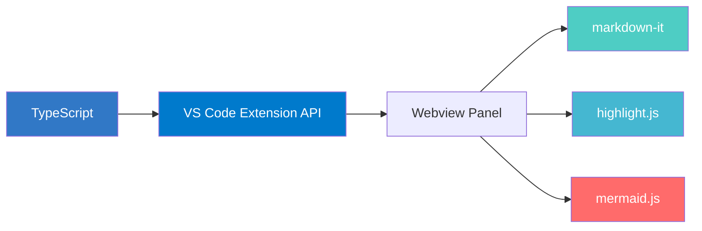

# Markdown Prettier

A powerful, feature-rich markdown preview extension for VS Code / Cursor — with a beautiful dark UI, live editing, and presentation mode built in.

---

## 1. Powerful Preview

Everything you write in markdown is rendered beautifully — code, diagrams, callouts, and more.

### Syntax Highlighting

Full syntax highlighting powered by [highlight.js](https://highlightjs.org/) with Atom One Dark theme. Supports all major languages including TypeScript, Python, Go, Rust, Dockerfile, SQL, and more.

### GitHub-style Callouts

Render `[!NOTE]`, `[!TIP]`, `[!IMPORTANT]`, `[!WARNING]`, and `[!CAUTION]` blocks with styled icons and colors — just like GitHub.

### Mermaid Diagrams

Render [Mermaid](https://mermaid.js.org/) diagrams directly in the preview — flowcharts, sequence diagrams, class diagrams, state diagrams, ER diagrams, Gantt charts, pie charts, and git graphs. Custom theming adapts to both dark and light modes.

### Rich Text Formatting

- **Bold** text gets a subtle background highlight for visual distinction
- *Italic*, ~~strikethrough~~, and `inline code` are fully styled
- `==highlighted text==` renders with a gradient marker effect (via `markdown-it-mark`)
- Blockquotes with accent border
- Tables with alternating row colors
- Task lists with checkboxes

### Additional Rendering

- **Heading visual hierarchy** — H1 through H6 with distinct opacity-based color scaling and border separators
- **Frontmatter stripping** — YAML frontmatter (`---`) is automatically hidden from the preview
- **Images** — Responsive sizing with rounded corners
- **Light & Dark mode** — All elements (headings, code blocks, tables, callouts, Mermaid, scrollbar) fully adapt to VS Code theme

---

## 2. Convenience & UX

### Table of Contents Sidebar

Auto-generated from headings (both ATX `#` and Setext `===`/`---` styles). Features include:
- Click-to-scroll with smooth animation
- Active section highlighting as you scroll
- Collapsible with toggle button
- Drag-resizable width (120px – 500px)
- Dotted indent guide lines for depth hierarchy
- Duplicate heading name support

### Bi-directional Scroll Synchronization

Editor-to-preview and preview-to-editor scroll sync with feedback loop prevention. Works in both side-by-side and full-screen preview modes.

### Presentation Mode

Turn your markdown into a slide presentation instantly:
- `---` horizontal rules act as slide separators
- Click the **▶** button in the top-right controls
- Navigate with **Arrow keys**, **Space**, **Home/End**
- Press **ESC** to exit
- Smooth sliding transition animations with slide counter

### Font Size Controls

**A+** / **A−** buttons in the top-right corner. All content scales proportionally (10px–20px range). Preference persists across sessions.

### PDF Export

One-click PDF export using headless Chrome/Chromium/Edge/Brave. Full styling, Mermaid diagrams, callouts, and smart page break handling are all preserved.

### Inline Editing & Ask Claude

- **Double-click** any block in the preview to edit its source markdown in-place (Ctrl+Enter to save, Esc to cancel)
- **Full edit mode** via the ✎ button — edit the entire document with Ctrl+S save
- **Ask Claude to Improve** — select text in the preview, a floating toolbar appears, click to send to Claude Code terminal for AI-assisted improvement

### Live Preview

Preview updates in real-time as you edit. Automatically switches when you open a different markdown file.

---

## 3. `/` Slash Commands

Type `/` in any markdown file to get instant snippet suggestions with rich preview documentation.

<video src="https://raw.githubusercontent.com/lyhlg/vscode-markdown-prettier-plugin/main/assets/videos/slash.mov" controls muted loop width="100%"></video>

| Command | Description |
|---------|-------------|
| `/h1` `/h2` `/h3` | Insert headings |
| `/codeblock` | Code block with language picker (JS, TS, Python, Bash, JSON, HTML, CSS, Dockerfile, YAML, Go, Rust, Java, SQL) |
| `/table` | Markdown table template |
| `/mermaid` | Mermaid diagram with type picker |
| `/mermaid-flowchart` `/mermaid-sequence` `/mermaid-class` | Specific diagram templates |
| `/note` `/tip` `/important` `/warning` `/caution` | GitHub-style callout blocks |
| `/image` `/link` | Media elements |
| `/checkbox` | Task list |
| `/bold` `/italic` `/highlight` `/strikethrough` | Text formatting |
| `/blockquote` `/hr` | Block elements |

Each command includes **rendered preview examples** and **mermaid.ink diagram previews** in the autocomplete documentation.

---

## Usage

1. Open any `.md` file
2. Press `Cmd + Shift + M` (macOS) / `Ctrl + Shift + M` (Windows/Linux)
   — or click the **MD icon** in the editor title bar
3. The preview opens in the current panel

## Keyboard Shortcuts

| Shortcut | Action |
|----------|--------|
| `Cmd + Shift + M` | Open Markdown Preview |
| `Ctrl + Shift + M` | Open Markdown Preview (Windows/Linux) |

### In Presentation Mode

| Shortcut | Action |
|----------|--------|
| `←` / `→` | Previous / Next slide |
| `Space` | Next slide |
| `Home` / `End` | First / Last slide |
| `ESC` | Exit presentation mode |

## Architecture

## License

MIT
