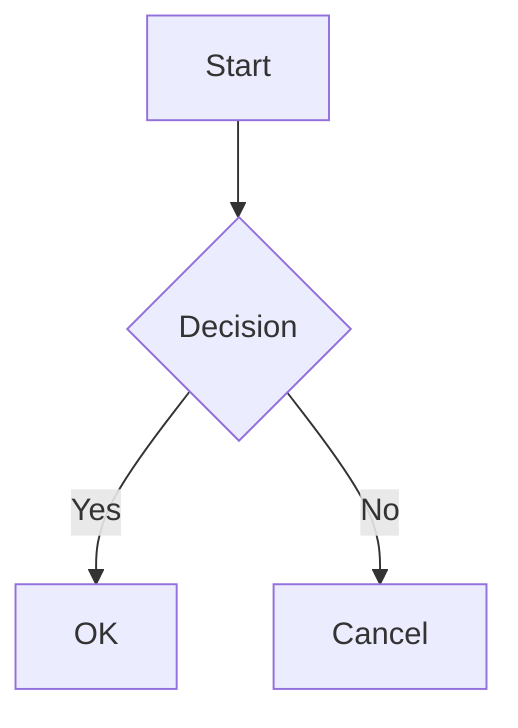

# Feature Enhancements Implementation Plan

> **For Claude:** REQUIRED SUB-SKILL: Use superpowers:executing-plans to implement this plan task-by-task.

**Goal:** Add syntax highlighting, Mermaid diagrams, editor↔preview scroll sync, and font size controls to the markdown preview extension.

**Architecture:** All changes are in `src/extension.ts`. highlight.js and mermaid.js load from CDN. Scroll sync uses VS Code's `onDidChangeTextEditorVisibleRanges` API to post messages to the webview. Font size state is persisted via `vscode.setState()`.

**Tech Stack:** TypeScript, VS Code Extension API, highlight.js CDN, mermaid.js CDN

---

### Task 1: Syntax Highlighting

**Files:**
- Modify: `src/extension.ts` — `getWebviewContent()` function

**Step 1: Add highlight.js CDN links in `<head>` of `getWebviewContent()`**

Insert after `<meta name="viewport" ...>`:
```html
<link rel="stylesheet" href="https://cdnjs.cloudflare.com/ajax/libs/highlight.js/11.9.0/styles/atom-one-dark.min.css">
<script src="https://cdnjs.cloudflare.com/ajax/libs/highlight.js/11.9.0/highlight.min.js"></script>
```

**Step 2: Override pre/code styles to not conflict**

In `<style>`, replace the existing `pre` and `code` blocks with:
```css
code {
  font-family: 'Fira Code', 'JetBrains Mono', 'Cascadia Code', Consolas, monospace;
  background: #2c313a;
  padding: 2px 6px;
  border-radius: 3px;
  font-size: 11.5px;
}

pre {
  margin: 12px 0;
  border-radius: 6px;
  overflow-x: auto;
}

pre code.hljs {
  border-radius: 6px;
  font-size: 12px;
  line-height: 1.6;
  padding: 16px;
}

pre code:not(.hljs) {
  background: #282c34;
  border: 1px solid #3e4451;
  padding: 16px;
  display: block;
}
```

**Step 3: Call `hljs.highlightAll()` at the end of the `<script>` block**

Add before the closing `</script>` tag:
```javascript
// Syntax highlighting
document.querySelectorAll('pre code').forEach(block => {
  hljs.highlightElement(block);
});
```

**Step 4: Manual verification**

- Press `F5` to launch Extension Development Host
- Open any `.md` file with a fenced code block (e.g. ` ```javascript `)
- Run `Markdown Prettier: Open Preview`
- Verify code block has colored syntax highlighting

**Step 5: Commit**
```bash
git add src/extension.ts
git commit -m "feat: add syntax highlighting with highlight.js"
```

---

### Task 2: Mermaid Diagram Rendering

**Files:**
- Modify: `src/extension.ts` — add `preprocessMermaid()` function, update `getWebviewContent()`

**Step 1: Add `preprocessMermaid()` function after `stripFrontmatter()`**

```typescript
function preprocessMermaid(markdown: string): string {
  return markdown.replace(/```mermaid\r?\n([\s\S]*?)```/g, '<div class="mermaid">$1</div>');
}
```

**Step 2: Call `preprocessMermaid()` in `getWebviewContent()` before `md.render()`**

Change:
```typescript
const stripped = stripFrontmatter(markdown);
const headings = extractHeadings(stripped);
let renderedHtml = md.render(stripped);
```
To:
```typescript
const stripped = stripFrontmatter(markdown);
const processed = preprocessMermaid(stripped);
const headings = extractHeadings(stripped); // use original for heading extraction
let renderedHtml = md.render(processed);
```

**Step 3: Add mermaid CDN + init in `<head>` after highlight.js scripts**

```html
<script src="https://cdn.jsdelivr.net/npm/mermaid/dist/mermaid.min.js"></script>
<script>mermaid.initialize({ startOnLoad: true, theme: 'dark' });</script>
```

**Step 4: Manual verification**

Create a test `.md` file containing:
````markdown
## Flow


````
Open preview — diagram should render graphically, not as raw text.

**Step 5: Commit**
```bash
git add src/extension.ts
git commit -m "feat: add mermaid diagram rendering"
```

---

### Task 3: Editor ↔ Preview Scroll Sync

**Files:**
- Modify: `src/extension.ts` — `extractHeadings()`, `activate()`, `getWebviewContent()`

**Step 1: Add `line` field to `Heading` interface**

Change:
```typescript
interface Heading {
  level: number;
  text: string;
  id: string;
}
```
To:
```typescript
interface Heading {
  level: number;
  text: string;
  id: string;
  line: number;
}
```

**Step 2: Track line numbers in `extractHeadings()`**

Change the loop to track line index:
```typescript
for (let i = 0; i < lines.length; i++) {
  const line = lines[i];
  const match = line.match(/^(#{1,6})\s+(.+)$/);
  if (match) {
    const level = match[1].length;
    const text = match[2].replace(/[#*_`\[\]]/g, '').trim();
    let id = text
      .toLowerCase()
      .replace(/[^\w\s\u3131-\uD79D-]/g, '')
      .replace(/\s+/g, '-');

    if (idCount[id] !== undefined) {
      idCount[id]++;
      id = `${id}-${idCount[id]}`;
    } else {
      idCount[id] = 0;
    }

    headings.push({ level, text, id, line: i });
  }
}
```

**Step 3: Add scroll sync listener in `activate()` inside the command handler**

After the `switchDisposable` declaration, add:
```typescript
const scrollDisposable = vscode.window.onDidChangeTextEditorVisibleRanges(e => {
  if (e.textEditor === editor && e.visibleRanges.length > 0) {
    const firstLine = e.visibleRanges[0].start.line;
    panel.webview.postMessage({ type: 'syncScroll', line: firstLine });
  }
});
```

Also update `panel.onDidDispose()`:
```typescript
panel.onDidDispose(() => {
  changeDisposable.dispose();
  switchDisposable.dispose();
  scrollDisposable.dispose();
});
```

**Step 4: Pass heading line data to webview and handle syncScroll message**

In `getWebviewContent()`, add `headings` parameter and embed as JSON:
```typescript
function getWebviewContent(markdown: string): string {
  const stripped = stripFrontmatter(markdown);
  const processed = preprocessMermaid(stripped);
  const headings = extractHeadings(stripped);
  let renderedHtml = md.render(processed);
  renderedHtml = addHeadingIds(renderedHtml, headings);
  const tocHtml = generateTocHtml(headings);
  const headingData = JSON.stringify(headings.map(h => ({ id: h.id, line: h.line })));
  // ... rest of function, inject headingData into script
```

In the webview `<script>` block, add before the closing tag:
```javascript
const headingData = ${headingData};

window.addEventListener('message', (event) => {
  const message = event.data;
  if (message.type === 'syncScroll') {
    const line = message.line;
    let targetId = null;
    for (let i = headingData.length - 1; i >= 0; i--) {
      if (headingData[i].line <= line) {
        targetId = headingData[i].id;
        break;
      }
    }
    if (targetId) {
      const target = document.getElementById(targetId);
      if (target) {
        target.scrollIntoView({ behavior: 'smooth', block: 'start' });
      }
    }
  }
});
```

**Step 5: Manual verification**

- Open a long `.md` file with multiple headings
- Open preview
- Scroll editor — preview should follow

**Step 6: Commit**
```bash
git add src/extension.ts
git commit -m "feat: add editor-preview scroll sync"
```

---

### Task 4: Font Size Control

**Files:**
- Modify: `src/extension.ts` — `getWebviewContent()` HTML template

**Step 1: Add CSS for font controls**

Add to the `<style>` block:
```css
.font-controls {
  position: fixed;
  top: 12px;
  right: 16px;
  display: flex;
  align-items: center;
  gap: 6px;
  z-index: 100;
  background: #21252b;
  border: 1px solid #3e4451;
  border-radius: 6px;
  padding: 4px 8px;
}

.font-btn {
  background: none;
  border: none;
  color: #abb2bf;
  cursor: pointer;
  font-size: 13px;
  font-weight: 700;
  padding: 0 2px;
  line-height: 1;
}

.font-btn:hover { color: #fff; }

.font-size-label {
  font-size: 11px;
  color: #666;
  min-width: 30px;
  text-align: center;
}
```

**Step 2: Add HTML for font controls inside `<body>` before `.container`**

```html
<div class="font-controls">
  <button class="font-btn" id="fontMinus">A−</button>
  <span class="font-size-label" id="fontSizeLabel">12px</span>
  <button class="font-btn" id="fontPlus">A+</button>
</div>
```

**Step 3: Add JavaScript for font size control in `<script>` block**

```javascript
// Font size control
const savedState = vscode.getState() || { fontSize: 12 };
let fontSize = savedState.fontSize;
document.body.style.fontSize = fontSize + 'px';
document.getElementById('fontSizeLabel').textContent = fontSize + 'px';

document.getElementById('fontMinus').addEventListener('click', () => {
  fontSize = Math.max(10, fontSize - 1);
  document.body.style.fontSize = fontSize + 'px';
  document.getElementById('fontSizeLabel').textContent = fontSize + 'px';
  vscode.setState({ fontSize });
});

document.getElementById('fontPlus').addEventListener('click', () => {
  fontSize = Math.min(20, fontSize + 1);
  document.body.style.fontSize = fontSize + 'px';
  document.getElementById('fontSizeLabel').textContent = fontSize + 'px';
  vscode.setState({ fontSize });
});
```

**Step 4: Manual verification**

- Open preview
- Click `A+` several times — text should grow
- Click `A−` — text should shrink
- Close and reopen preview — font size should reset (webview state resets on close, this is expected)

**Step 5: Compile and final commit**
```bash
npm run compile
git add src/extension.ts
git commit -m "feat: add font size control buttons"
```

---

### Final: Package and Release

```bash
npm run update-and-publish
```
Bumps version, packages `.vsix`, pushes to GitHub, creates release.
